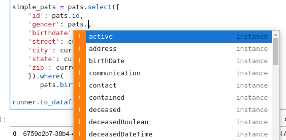

# FHIR Views

## Introduction

FHIR Views is a way to define simple, tabular views over complex FHIR data and
turn them into queries that use
[SQL on FHIR conventions](https://github.com/FHIR/sql-on-fhir), or other data
sources in the future. It is installed as part of a simple `pip install
google-fhir-views[r4,bigquery]` command.

FHIR Views has two main concepts:

*   A view *definition*, which defines the fields and criteria created by a
    view. It provides a Python API for convenience, but ultimately a
    view definition is a set of FHIRPath expressions that we'll explore below.
*   A view *runner*, which creates that view over some data source.

For example, let's create a simple view of patient resources for patients born
before 1960:

```py
import datetime
from google.fhir.views import bigquery_runner, r4

# Load views based on the base FHIR R4 profile definitions.
views = r4.base_r4()

# Creates a view using the base patient profile.
pats = views.view_of('Patient')

# In this case we interpret the 'current' address as one where period is empty.
# This can be adjusted to meet the needs of a specific dataset.
current = pats.address.where(pats.address.period.empty()).first()

simple_pats = pats.select({
    'id': pats.id,
    'gender': pats.gender,
    'birthdate': pats.birthDate,
    'street': current.line.first(),
    'city': current.city,
    'state': current.state,
    'zip': current.postalCode
    }).where(
       pats.birthDate < datetime.date(1960,1,1))

```

If you run the above in a Jupyter notebook or similar tool, you'll notice that
the view builder supports tab suggestions that matches the fields in the FHIR
resource of the given profile. In fact, this is just a Pythonic way to build
FHIRPath expressions to be used by the runner, with suggestions available
by just pressing tab:



That builder is convenient for Python users, but you can also see the FHIRPath
expression themselves by just getting the string representation of the view,
such as by running `print(simple_pats)`. Notice every column and the 'where'
criteria are defined by FHIRPath expressions:

```
View<http://hl7.org/fhir/StructureDefinition/Patient.select(
  id: id,
  gender: gender,
  birthdate: birthDate,
  street: address.where(period.empty()).first().line.first(),
  city: address.where(period.empty()).first().city,
  state: address.where(period.empty()).first().state,
  zip: address.where(period.empty()).first().postalCode
).where(
  birthDate < @1960-01-01
)>
```

In other words, any _runner_ implementation would basically use the FHIRPath
expressions to select and filter the underlying data. The example below
will use a BigQuery runner, which translates FHIRPath expressions into SQL,
but runners in Apache Spark and directly on JSON will follow. This could
also be exported as a simple JSON structure and passed to remote services
to evaluate the FHIRPath expressions and produce a view for the user.

Now that we've defined a view, let's run it against a real dataset. We'll run
this over BigQuery:

```py
# Get a BigQuery client. This may require additional authentication to access
# BigQuery, depending on your notebook environment. Typically the client
# and runner are created only once at the start of a notebook.
from google.cloud import bigquery as bq
client = bq.Client()
runner = bigquery_runner.BigQueryRunner(
    client,
    fhir_dataset='bigquery-public-data.fhir_synthea',
    snake_case_resource_tables=True)

runner.to_dataframe(simple_pats, limit = 5)
```

Which produces this table:

|    | id                                   | gender   | birthdate   | street                   | city        | state         |   zip |
|---:|:-------------------------------------|:---------|:------------|:-------------------------|:------------|:--------------|------:|
|  0 | 6759d2b7-38b4-4798-97c0-d171a53e013a | male     | 1916-03-21  | 659 Bayer Wall Apt 61    | Boston      | Massachusetts | 02108 |
|  1 | 41dbee4d-d355-413f-a040-93ca037fe646 | male     | 1951-12-05  | 226 Sipes Ranch Unit 37  | Lynnfield   | Massachusetts | 01940 |
|  2 | e194d708-8989-4e0c-a8e1-eda7351672ce | male     | 1947-09-24  | 638 Pouros Wall Suite 52 | Lynnfield   | Massachusetts | 01940 |
|  3 | 4bccdc85-c040-45dd-ada3-a55064439a01 | male     | 1943-06-20  | 825 Jakubowski Extension | Tewksbury   | Massachusetts | 01876 |
|  4 | 8dca4c3c-d2d5-460f-9168-5f18e5d29b2b | male     | 1945-12-13  | 319 Cronin Light         | Hubbardston | Massachusetts | 01452 |


That's it! Now the returned dataframe contains a table of the example patients
described in the query, pulled from the FHIR data stored in BigQuery. Examples
below will show more sophisticated use cases such as turning a FHIR view into
a BigQuery virtual view or incorporating clinical content from code value sets.

At this time we support a BigQuery runner to consume FHIR data in BigQuery as
our data source, but future runners may support other data stores, FHIR servers,
or FHIR bulk extracts on disk.

## Working with code values

Most meaningful analysis of healthcare data involves navigating clinical
terminologies. In some cases these value sets come from an established authority
like the [Value Set Authority Center](https://vsac.nlm.nih.gov/), and other
times they are defined and maintained locally for custom use cases.

FHIR Views offers a convenient mechanism to create and use such value sets in
your queries. Here is an example that defines a collection of LOINC codes
indicating LDL results:

```py
LDL_TEST = r4.value_set('urn:example:value_set:ldl').with_codes(
    'http://loinc.org', ['18262-6', '18261-8', '12773-8']).build()
```

Now we can easily query observations with a view that uses the FHIRPath
`memberOf` function:

```py
# Creates the base observation view for convenience, typically done once per
# base type in a notebook.
obs = views.view_of('Observation')

ldl_obs = obs.select({
    'patient': obs.subject.idFor('Patient'),
    # Below is a Pythonic shorthand -- users could type
    # `obs.value.ofType('Quantity').value` instead for the FHIRPath ofType
    # expression, but the shorthand helps autocompletion
    'value': obs.valueQuantity.value,
    'unit': obs.valueQuantity.unit,
    'test': obs.code.coding.display.first(),
    'effectiveTime': obs.effectiveDateTime
    }).where(obs.code.memberOf(LDL_TEST))

runner.to_dataframe(ldl_obs, limit=5)
```

|    | patient                              |    value | unit   | test                                | effectiveTime             |
|---:|:-------------------------------------|---------:|:-------|:------------------------------------|:--------------------------|
|  0 | 903156da-ca5d-4ec3-ad36-073a9437afe4 | 153.058  | mg/dL  | Low Density Lipoprotein Cholesterol | 2014-06-20 11:30:15+00:00 |
|  1 | 3d268dce-fed4-4bc7-b156-c78e810c5183 | 149.379  | mg/dL  | Low Density Lipoprotein Cholesterol | 2013-06-10 16:20:36+00:00 |
|  2 | fdf7c87b-1c8f-4d09-8d51-e622f747a7c8 |  88.047  | mg/dL  | Low Density Lipoprotein Cholesterol | 2013-10-07 00:08:45+00:00 |
|  3 | 9007c0ff-a0ad-48dc-adc2-c0908c06fba8 | 108.145  | mg/dL  | Low Density Lipoprotein Cholesterol | 2016-03-18 10:31:54+00:00 |
|  4 | cc5a2dd6-37b6-4f15-9da7-53f3b85e3370 |  64.5849 | mg/dL  | Low Density Lipoprotein Cholesterol | 2012-05-26 13:27:46+00:00 |


## Working with external value sets and terminology services

You can also work with value sets defined by external terminology services. To
do so, you must first create a terminology service client.

This example uses the UMLS terminology service from the NIH. In order access
this terminology service, you need to
[sign up here.](https://uts.nlm.nih.gov/uts/signup-login) You should then enter
the API key found [on your profile page](https://uts.nlm.nih.gov/uts/profile) in
the place of 'your-umls-api-key' below.

```py
from google.fhir.r4.terminology import terminology_service_client

tx_client = terminology_service_client.TerminologyServiceClient({
    'http://cts.nlm.nih.gov/fhir/': ('apikey', 'your-umls-api-key'),
})
```

Before making queries against an externally-defined value set, you must first
get the codes defined by the value set and write them to a BigQuery table. You
only need to perform this step once. After doing so, you'll be able to reference
the value set definitions you've written in future queries.

```py
injury_value_set_url = 'http://cts.nlm.nih.gov/fhir/ValueSet/2.16.840.1.113762.1.4.1029.5'
wound_disorder_value_set_url = 'http://cts.nlm.nih.gov/fhir/ValueSet/2.16.840.1.113762.1.4.1219.178'
runner.materialize_value_set_expansion((injury_value_set_url, wound_disorder_value_set_url), tx_client)
```

To make queries against an externally-defined value set which you've saved to
BigQuery, you can simply refer to its URL.

```py
injury_conds =  cond.select({
    'id': cond.id,
    'patientId': cond.subject.idFor('Patient'),
    'codes': cond.code}
    ).where(cond.code.memberOf(injury_value_set_url))

runner.create_database_view(injury_conds, 'injury_conditions')
```

## Saving FHIR Views as BigQuery Views

While `runner.to_dataframe` is convenient to retrieve data for local analysis,
it's often useful to create such flattened views in BigQuery itself. They can be
easily queried with much simpler SQL, or used by a variety of business
intelligence or other data analysis tools.

For this reason, the BigQueryRunner offers a `create_database_view` method that
will convert the view definition into a
[BigQuery View](https://cloud.google.com/bigquery/docs/views), which can then
just be consumed as if it was a first-class table that is updated when the
underlying data is updated. Here's an example:

```py
runner.create_database_view(ldl_obs, 'ldl_observations')
```

By default the view is created in the fhir_dataset used by the runner, but this
isn't always desirable (for example, a user may want to do their analysis in
their own, isolated dataset). Therefore it's common to specify a `view_dataset`
when creating the runner as the target for any views created. Here's an example:

```py
runner = bigquery_runner.BigQueryRunner(
    client,
    fhir_dataset='bigquery-public-data.fhir_synthea',
    view_dataset='example_project.diabetic_care_example')
```
